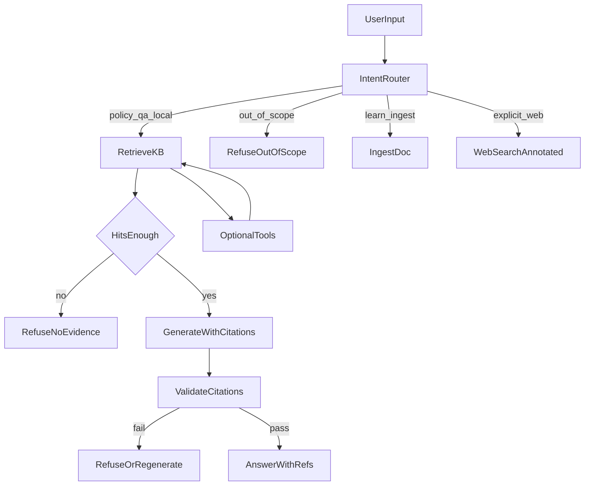

# 02 · 完整链路设计

> 目标：用户输入后，系统按固定阶段推进——**不是**「一句话进、一段话出」。  
> 垂直约束：制度类问题必须「检索 → 有据生成 → 校验」；无据则拒绝。  
> 版本：v1.0 · 2026-07-16

---

## 1. 总览



### 阶段门禁（必须遵守）

| 阶段 | 通过条件 | 未通过时 |
|------|----------|----------|
| 意图 | 能归入已知 Intent | 保守走 LOCAL 检索，禁止直接自由生成制度条款 |
| 检索 | Top-K 命中且相关分够 | `RefuseNoEvidence` |
| 生成 | 仅基于 hits（+ 允许的工具结果） | 不得用模型私货补制度数字 |
| 校验 | 硬断言有引用；无禁止话术 | 拒绝或降级重生成 |
| 兜底 | 超时 / LLM 挂 / 外网挂有定义行为 | 见第 8 节 |

---

## 2. 意图识别

**实现入口**：`backend/app/agents/planner.py` → `plan_turn(user_text, hits=None)`  
**编排入口**：`ChatAgent.stream_chat`（先预检索，再规划）

### 2.1 Intent 一览（Atlas）

| Intent | 含义 | 制度场景是否允许 |
|--------|------|------------------|
| `learn` | 显式入库 | 允许（制度维护） |
| `auto_learn` | 自主学习并入库 | **谨慎**：百科内容 ≠ 本公司制度，不得当制度金标准 |
| `web` | 强制联网 | 仅用户显式要求；答案须标注非本公司制度 |
| `research` | 多方面检索补充 | 制度问答默认**不因空库自动 research 编造** |
| `local` | 本地知识库问答 | **默认主路径** |
| `tool_time` / `tool_calc` | 时间 / 计算 | 允许（辅助，不替代制度条文） |

### 2.2 路由优先级（与代码一致）

1. `parse_learn_intent` → `LEARN`  
2. `parse_auto_learn_intent` → `AUTO_LEARN`  
3. 显式联网意图 → `WEB`  
4. 时间 / 计算关键词 → `TOOL_*`  
5. 本地 hits 薄弱时：现码可能转 `WEB` / `RESEARCH`  
6. 否则 → `LOCAL`

### 2.3 制度场景规范增量（相对现码，T2 落地）

规范要求（文档约束；实现按开发流程 T2 加固）：

- 识别为**制度问答**（关键词：报销、差旅、考勤、假期、制度、额度、发票等）时：
  - 默认 `LOCAL`
  - **禁止**因空库自动升级为 `WEB` / `RESEARCH` 后当作制度答案
  - 空库 → `RefuseNoEvidence`（可提示「请上传制度」或联系 HR）

---

## 3. 任务拆解

`AgentPlan` 字段（`planner.py`）：`intent`、`query`、`steps`、`force_web`、`use_research`、`use_web`、`learn_payload`、`notes`。

| 意图 | 典型 steps | 说明 |
|------|------------|------|
| LOCAL | （预检索已完成）→ 可选 `search_graph` → `synthesize` | 图谱默认关 |
| LEARN | `learn_knowledge` → `confirm` | 不走 RAG 综合 |
| WEB | `web_search` → `synthesize` | 制度场景须标注来源非内规 |
| RESEARCH | `research_topics` ± `web_search` → `synthesize` | 同上 |
| TOOL_* | 对应 tool → `synthesize_tool_answer` | 短答 |

拆解原则：

- **一步一事**：检索、入库、联网、综合分开，便于 Trace  
- **步数上限**：`agent_max_steps`（默认 4），防死循环  
- **制度问答**：steps 中不应出现「无用户明示」的 web/research

---

## 4. 何时解锁知识库

| 时机 | 行为 | 代码位置 |
|------|------|----------|
| 对话轮次开始（默认） | `KnowledgeService.search`，span `retrieve_local` | `ChatAgent.stream_chat` |
| 计划含 `search_knowledge` | 循环内再检索（预检索已有 hits 时可跳过） | `loop.py` → `run_react_retrieval` |
| LLM tool_choice | 模型可主动调 `search_knowledge` | `_llm_stream` + `TOOL_SPECS` |
| 入库后 | 写入 `documents`，下次检索可命中 | `learn_knowledge` / ingest |

**解锁条件（规范）**：

- 意图为 LOCAL / 制度问答 → **必须先检索再生成**
- 意图为 LEARN → 写库，不强制检索
- 意图为显式 WEB → 可跳过本地，但不得把网页当内规

**Hits 足够判定（规范口径）**：

- 有命中且 `filter_relevant_hits` 后非空
- 弱相关（如 top score 过低）→ 允许作答但必须加「不确定」脚注，或直接拒绝（制度硬数字场景优先拒绝）

---

## 5. 何时调用工具

**工具注册**：`backend/app/tools/__init__.py` → `run_tool`

| 工具 | 触发条件 | 制度场景白名单 |
|------|----------|----------------|
| `search_knowledge` | LOCAL / 计划需要 | **必选** |
| `learn_knowledge` | 记住 / 维护制度 | 允许 |
| `get_current_time` | 时间类问句 | 允许 |
| `calculator` | 计算类问句 | 允许（如按比例算金额，但仍须引用制度比例来源） |
| `web_search` | 显式联网 | 仅显式；结果标注非内规 |
| `research_topics` | 自主学习 | 不得替代制度金标准 |
| `search_graph` | `RAG_GRAPH_ENABLED` | 可选；失败回退文档 RAG |

**误调用防护（规范）**：

- 工具描述写清「做什么 / 不做什么」
- 制度意图下：web/research 默认 false
- Trace 记录每次 `tool_*` span，评测用 `must_plan_step` / `expected_intent` 卡住回归

---

## 6. 如何生成答案

| 路径 | 条件 | 行为 |
|------|------|------|
| Mock / fallback | 无 Key 或 LLM 失败 | `synthesize_knowledge_answer`：仅基于 hits 拼接 + `**参考**` |
| 真实 LLM | 有 Key | 系统提示要求引用；可 tool_choice |
| 空 hits | 任意 | **拒绝话术**（不足以完整回答 + 补充指引） |
| LEARN | 入库成功 | 短确认，不编制度 |
| TOOL_* | 工具返回 | `synthesize_tool_answer` |

生成约束：

1. 有据断言：事实来自 hits  
2. 不足标注：弱相关加不确定  
3. 引用格式：文末 `**参考**`，含标题；有则带 `document_id=`  
4. 制度数字：无命中不得输出具体额度 / 比例

---

## 7. 如何校验结果

| 校验项 | 方法 | 失败动作 |
|--------|------|----------|
| 是否有引用 | 答案含 `**参考**` 或等价结构 | 拒答或重生成 |
| 是否可追溯 | 存在 `document_id=` 或稳定标题 | 降级为「仅供参考、请核对原文」或拒答 |
| 空库是否仍断言 | 评测 `forbid_phrases` + 人工抽检 | 必修 |
| 是否超范围胡答 | 超范围用例 | 拒答 |
| 意图是否正确 | `expected_intent` | 修路由 |

评测侧字段见 [03-评测规范.md](03-评测规范.md)。  
运行时校验：当前以 synthesize 空结果分支 + 评测门禁为主；T2/T4 可加强「无引用则拦截输出」。

---

## 8. 失败如何兜底

与母本降级矩阵对齐，制度场景补充如下：

| 触发 | 用户可见行为 | Trace |
|------|--------------|-------|
| 检索空 / 弱到不可用 | 明确「库内暂无依据」，**不编造** | `hits=0` |
| 无 API Key | Mock 综合（仍基于 hits） | `mode=mock` |
| LLM 超时 / 5xx | `mock_fallback` | `llm_error` |
| 外网失败 | 跳过 web；制度问答本就不依赖外网 | `circuit_skip` 等 |
| 并发超额 | HTTP 429 | concurrency |
| 上传超限 | 4xx 可读错误 | ingest 日志 |
| 图谱失败 | 仅文档 RAG | `graph_disabled` / error |

**制度场景铁律**：任何兜底路径都**不得**用「看起来像真的」的模型私货填充制度条款。

---

## 9. 端到端示例：报销制度

### 9.1 有依据

```text
用户：差旅住宿费上限是多少？

1. IntentRouter     → local（制度问答）
2. RetrieveKB       → 命中《差旅报销制度》块，含「住宿费上限 500 元/晚」
3. HitsEnough       → yes
4. Generate         → 「根据《差旅报销制度》，住宿费上限为 500 元/晚。…」
5. Validate         → 含 **参考** 与 document_id=
6. Answer           → 返回用户；Trace 记录 retrieve_local / plan / synthesize
```

### 9.2 无依据

```text
用户：海外医疗险报销比例是多少？

1. IntentRouter     → local
2. RetrieveKB       → hits=[] 或过滤后为空
3. HitsEnough       → no
4. RefuseNoEvidence → 「目前掌握的材料还不足以…请补充制度文档或联系 HR」
5. 禁止输出「一般为 xx%」类编造
```

### 9.3 错误示范（禁止）

```text
用户：海外医疗险报销比例是多少？
模型：一般公司是 80%，你们大概也是这个水平。  ← 幻觉，评审一票否决
```

---

## 10. 与代码的对照表

| 环节 | 路径 |
|------|------|
| 预检索 + 编排 | `backend/app/agents/__init__.py` → `ChatAgent.stream_chat` |
| 意图 | `backend/app/agents/planner.py` → `plan_turn` |
| 工具循环 | `backend/app/agents/loop.py` → `run_react_retrieval` |
| 工具执行 | `backend/app/tools/__init__.py` → `run_tool` |
| 检索 | `backend/app/rag/hybrid.py` 等 |
| Trace | `backend/app/observability/traces.py` |

---

## 11. 检查清单

- [ ] 能画出「意图 → 检索 → 门禁 → 生成 → 校验 → 兜底」并对照代码
- [ ] 报销有据 / 无据两条路径都能口述
- [ ] 说清制度问题为何不能空库转联网编答案
- [ ] 知道用哪个 `run_id` 字段排查误调用
