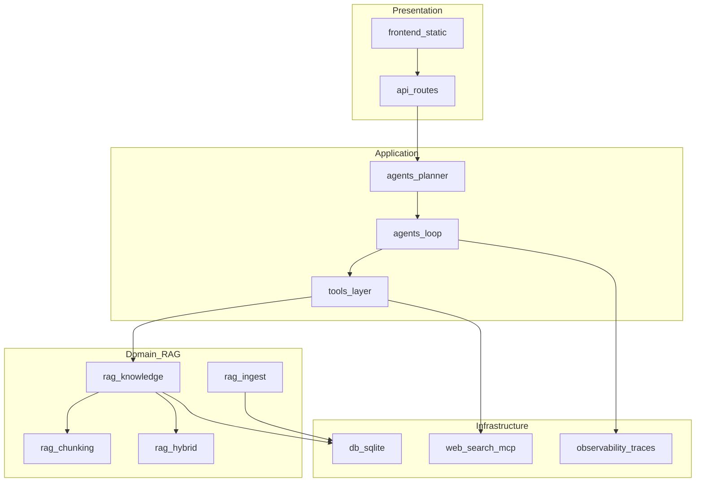

# 06 · 架构分层与迭代计划

> 原名：知识库工程规范与迭代计划（架构 / 降级 / 资源母本）  
> 文档定位：按大厂常见评审口径整理，并以本仓库 **Atlas** 为落地对照。  
> 范围：**文档 RAG 为主线**；**知识图谱为后续阶段**（不阻塞 MVP）。  
> 默认实现栈：**Python 3.10+ / FastAPI / SQLite**。  
> 版本：v1.5 · 更新日期：2026-07-16 · 归属目录：`规范文档/`

### 文档地图

本文件为 **架构 / 迭代 / 降级 / 资源** 母本。全套规范见本目录：

| 文档 | 内容 |
|------|------|
| [README.md](README.md) | 统一索引 |
| [00-总则与开发流程.md](00-总则与开发流程.md) | 模式、T0–T6、写码纪律 |
| [01](01-场景与价值.md)–[05](05-工程化规范.md) | 场景 / 链路 / 评测 / 优化 / 工程化 |
| [07-现状差距与实现待办.md](07-现状差距与实现待办.md) | 规范 vs 代码；开工清单 |
| [08-Prompt版本与变更记录.md](08-Prompt版本与变更记录.md) | Prompt 版本账本 |

---

## 1. 背景与目标

### 1.1 产品一句话

本地可运行的「**可学习、可引用、可降级**」Agent 知识库：用户能把知识写入库，问答时检索并引用依据；外部依赖失败时仍能演示与答疑，且默认路径不拖垮本机资源。

### 1.2 对齐的评审维度

| 维度 | 要求摘要 |
|------|----------|
| 场景价值 | 有明确人群、场景与痛点；能回答「解决了谁的什么问题」 |
| 架构清晰 | 表现层 / 应用层 / 领域层 / 基础设施层职责分明，禁止跨层耦合 |
| 可迭代 | 有分阶段目标与可验收标准，而非一次性堆功能 |
| 稳定性 | 超时、失败路径、空结果均有定义；关键链路可观测 |
| 降级策略 | 外部依赖不可用时行为可预期，不整站不可用 |
| 资源可控 | 无高占用默认路径；重模块可选、可关、有上限 |

### 1.3 技术选型：为何用 Python

在本项目（知识库 / RAG / Agent 工具链）语境下，Python **更易维护**，依据是工程成本而非语言优劣：

| 优势 | 说明 |
|------|------|
| 生态匹配 | LLM SDK、解析库、评测脚本、MCP/工具调用以 Python 为默认交付语言 |
| 与现状一致 | 仓库已是 FastAPI + SQLite + `backend/app/rag/*`，规范可直接对照代码 |
| 边界清晰 | 业务编排用 Python；向量检索 / 图查询等热路径可外置专用存储，无需整仓换语言 |

| 代价与对策 | 说明 |
|------------|------|
| CPU 密集 / 高并发非强项 | 用异步 I/O、外部检索引擎、限流、资源上限与降级补齐 |
| 重型 ML 依赖易拖垮本机 | Whisper / XTTS / embedding 必须懒加载、默认可关 |

**结论**：规范将 **Python 3.10+ / FastAPI** 定为默认实现栈；图谱阶段可用 Neo4j 或 SQLite 属性图等，仍由 Python 服务层编排。

---

## 2. 使用场景与人群

### 2.1 目标人群

- 需要本地演示 Agent / RAG 全流程的 **实习与校招作品集作者**
- 希望「记住资料 → 引用作答」、无 API Key 也能跑通的 **个人开发者 / 工程师**
- 在 Cursor 等 IDE 中通过 MCP 调用本机知识库工具的 **AI 应用开发者**

### 2.2 核心痛点

| 痛点 | 若无本系统会怎样 |
|------|------------------|
| 幻觉难核验 | 模型空口断言，无法追溯到库内文档 |
| 知识分散难复用 | 笔记、PDF、网页摘要散落各处，对话无法统一检索 |
| 无 Key 时不可演示 | 依赖云端 LLM 则答辩/演示中断 |
| 重依赖导致本机不可用 | 一装向量库 / 大模型语音栈就占满内存与磁盘 |

### 2.3 非目标（明确不做）

- 企业级多租户、细粒度 ACL、审计合规平台
- 亿级向量检索、跨机房高可用集群
- 实时多人协作文档编辑
- 替代通用搜索引擎的全网索引

### 2.4 场景验收（输入 → 行为 → 成功标准）

#### 场景 S1：会话检索并引用作答

| 项 | 内容 |
|----|------|
| 输入 | 用户就已入库主题提问（如「Agent 开发要学什么」） |
| 系统行为 | 意图路由为本地检索 → 混合打分召回 → 综合回答 |
| 成功标准 | 回答含可核验依据（标题或 `document_id` 可追溯）；评测用例 `must_hit_title_any` 通过 |

#### 场景 S2：显式学习入库

| 项 | 内容 |
|----|------|
| 输入 | `记住：标题\|内容`，或侧栏/API 写入 |
| 系统行为 | 解析意图 → 写入 `documents` → 确认反馈 |
| 成功标准 | 再次检索该标题/关键词可命中；内容持久化于 SQLite |

#### 场景 S3：知识不足时自主学习 / 联网补充

| 项 | 内容 |
|----|------|
| 输入 | `自主学习：工业革命` 或含「最新/搜索」的问题 / `联网：…` |
| 系统行为 | `research_topics` / `web_search` → 摘要入库（可选）→ 再综合 |
| 成功标准 | 计划步骤含对应 tool；外网失败时降级为本地检索或明确「不确定」 |

#### 场景 S4：文件扩充知识库

| 项 | 内容 |
|----|------|
| 输入 | 上传 PDF / 图片 / TXT / MD |
| 系统行为 | 解析文本 → 入库 → 可被分块检索 |
| 成功标准 | 超限文件被拒绝并返回可读错误；合法文件可 `search` 命中 |

#### 场景 S5：无 Key 全流程演示

| 项 | 内容 |
|----|------|
| 输入 | `MOCK_MODE=auto` 且无 `LLM_API_KEY` |
| 系统行为 | 走 Mock 综合作答，工具与检索链路仍执行 |
| 成功标准 | 聊天、学习、检索、Trace 均可演示；不因缺 Key 崩溃 |

---

## 3. 需求分层

### 3.1 功能需求（FR）

| ID | 需求 | 优先级 |
|----|------|--------|
| FR-01 | 文本 / 文件入库（含来源类型 `source_type`） | P0 |
| FR-02 | 长文分块（句级切分 + 重叠） | P0 |
| FR-03 | 混合检索：关键词 lexical + TF-IDF 余弦 | P0 |
| FR-04 | 回答引用格式：有据断言、不足标注不确定 | P0 |
| FR-05 | 自主学习（百科等多方面检索并入库） | P1 |
| FR-06 | 联网查询与摘要抓取 | P1 |
| FR-07 | Agent 意图路由 + ReAct 工具循环 | P0 |
| FR-08 | 评测集回归（`cases.yaml` + `run_eval.py`） | P1 |
| FR-09 | Agent Trace（耗时 / spans）可查询 | P1 |
| FR-10 | MCP 导出知识库等工具 | P2 |
| FR-11 | 可选向量检索（默认关闭） | P3 |
| FR-12 | 知识图谱抽取与子图查询（可关闭） | P4 |

### 3.2 非功能需求（NFR）

| ID | 类别 | 要求 |
|----|------|------|
| NFR-01 | 稳定 | 外部 HTTP（LLM / Wiki / DDG）必须有超时；失败不拖垮事件循环 |
| NFR-02 | 稳定 | LLM 不可用时自动或强制 Mock；联网失败可仅本地检索 |
| NFR-03 | 降级 | 见第 7 章降级矩阵（L0–L3） |
| NFR-04 | 资源 | 默认路径：SQLite + 内存 TF-IDF，**无 GPU、无常驻向量库硬依赖** |
| NFR-05 | 资源 | 上传大小、单次召回块数、research 页数、Agent 步数均有上限 |
| NFR-06 | 资源 | Whisper / XTTS 懒加载，配置可禁用 |
| NFR-07 | 可维护 | 目录分层见第 4 章；API 契约稳定；评测作为合并门禁 |
| NFR-08 | 可观测 | 每轮对话可关联 `run_id`；检索与工具步骤进入 spans |
| NFR-09 | 扩展 | 新增检索后端或图谱存储时，不修改前端；通过领域层接口扩展 |

---

## 4. 架构分层

### 4.1 分层总览



### 4.2 各层职责与禁止事项

| 层 | 目录（Atlas） | 职责 | 禁止 |
|----|---------------|------|------|
| 表现层 | `frontend/`、`backend/app/api/` | HTTP/SSE、表单校验、流式事件 | 写检索打分、拼业务编排 |
| 应用层 | `backend/app/agents/`、`tools/` | 意图路由、ReAct 循环、工具编排 | 直接操作 SQLAlchemy Session 细节（应经 crud/领域服务） |
| 领域层 | `backend/app/rag/` | 分块、打分、入库语义、research/web 领域逻辑 | 依赖具体前端或 SSE 细节 |
| 基础设施 | `db/`、`observability/`、`mcp/`、`stt/`、`tts/` | 持久化、Trace、协议适配、语音 | 承载业务决策（如「该不该联网」） |

### 4.3 关键代码对照

| 能力 | 路径 |
|------|------|
| 混合检索 | `backend/app/rag/hybrid.py`、`chunking.py`、`retriever.py`（TF-IDF / 可选向量） |
| 知识读写 | `backend/app/rag/knowledge.py`、`ingest.py` |
| 可选向量 | `backend/app/rag/embeddings.py`、`vector_index.py`（默认关） |
| 自主学习 / 联网 | `backend/app/rag/research.py`、`web_search.py` |
| 意图与循环 | `backend/app/agents/planner.py`、`loop.py` |
| 数据模型 | `backend/app/db/models.py`（`documents` / `graph_entities` / `graph_relations`） |
| 可选图谱 | `backend/app/rag/graph_*.py`（默认关；`search_graph` 工具） |
| 配置与 Mock | `backend/app/config.py`（`mock_mode` / `use_mock`） |
| 评测 | `backend/tests/eval/cases.yaml`、`scripts/run_eval.py` |

### 4.4 扩展原则

1. **开闭**：新增一种检索器（如向量）时，实现统一「检索接口」，由配置开关选择，而不是在 `routes.py` 分支堆逻辑。
2. **依赖单向**：表现 → 应用 → 领域 → 基础设施；禁止领域层 import API schema。
3. **工具即边界**：对外能力（MCP、HTTP tools）只暴露稳定工具名与参数，内部实现可替换。

---

## 5. 知识图谱阶段（P4，不阻塞 MVP）

文档 RAG 解决「段落级证据」；图谱解决「实体关系推理与多跳问题」。二者融合时，**图谱失败必须回退纯文档检索**。

### 5.1 Schema 最小集

| 概念 | 字段（示例） |
|------|----------------|
| 实体 Entity | `id`, `name`, `type`, `aliases`, `source_doc_ids`, `created_at` |
| 关系 Relation | `id`, `from_id`, `to_id`, `rel_type`, `evidence_span`, `confidence`, `source_doc_id` |
| 溯源 | 任何图谱断言必须能回到 `document_id` + 原文片段 |

实体类型与关系类型需版本化（如 `schema_version=1`），避免静默破坏查询。

### 5.2 流水线

```text
文档入库 →（可选）抽取 → 校验/去重 → 图存储 → 查询工具
                ↓ 失败
            仅文档 RAG（用户无感或提示「图谱暂不可用」）
```

- 抽取：优先规则 / 轻量 NLP；LLM 抽取仅在显式开启且有预算时使用。
- 校验：关系端点必须存在；置信度低于阈值不入库。
- 存储：MVP 可用 SQLite 两表模拟属性图；规模上来再迁 Neo4j 等。

### 5.3 查询与 GraphRAG 轻量融合

1. 从问题识别实体候选（关键词 / 别名）。
2. 取 k 跳子图，将三元组序列化为检索上下文。
3. 与文档块混合送入综合层；仍要求引用可追溯。

### 5.4 资源策略

- 配置项默认 **关闭** 图谱抽取与查询（`RAG_GRAPH_ENABLED=false`）。
- 抽取为规则 / 轻量 NLP（默认同进程、失败吞掉）；单文档实体/关系数有上限。
- 关闭或查询失败时仅文档 RAG；Trace 记 `graph_disabled` / `graph_query` error。

### 5.5 P4 实现约定（已落地）

| 配置项 | 默认 | 含义 |
|--------|------|------|
| `RAG_GRAPH_ENABLED` | `false` | 总开关；关则不抽取、不查询 |
| `RAG_GRAPH_EXTRACT_ON_LEARN` | `true` | 仅当 enabled 时：入库后规则抽取 |
| `RAG_GRAPH_MAX_ENTITIES_PER_DOC` | `32` | 单文档实体上限 |
| `RAG_GRAPH_MAX_RELATIONS_PER_DOC` | `48` | 单文档关系上限 |
| `RAG_GRAPH_MIN_CONFIDENCE` | `0.5` | 低于阈值不入库 / 不返回 |
| `RAG_GRAPH_HOPS` | `1` | 子图默认跳数 |
| `RAG_GRAPH_SCHEMA_VERSION` | `1` | Schema 版本号 |

行为约定：

1. **默认关**：`search_graph` / `GET /api/knowledge/graph` 返回 `status=graph_disabled`；LOCAL 计划不含图谱步骤。
2. **开启**：规则抽取写入 SQLite；LOCAL 计划含 `search_graph`；三元组序列化为检索上下文（`source_type=graph`）。
3. **失败降级**：抽取/查询异常不影响 `search_knowledge` 与对话主路径。
4. **远期**：LLM 抽取、Neo4j、多跳推理增强 — 不在本仓库 MVP 范围。

---

## 6. 迭代计划

| 阶段 | 目标 | 主要产出 | 验收标准 |
|------|------|----------|----------|
| **P0 现状固化** | 规范可独立评审 | 本文档；场景 / 分层 / 降级矩阵 | 答辩时可脱离代码讲清价值与边界 |
| **P1 质量门禁** | 行为可回归 | 扩充 `cases.yaml`；引用结构约定；上传/块数上限配置化 | `scripts/run_eval.py` 全绿；越限有明确错误 |
| **P2 可观测与限流** | 故障可定位、无雪崩 | Trace 覆盖检索耗时；并发/超时配置进 `Settings` | `GET /api/runs` 可见关键 spans；压测下有拒绝而非拖死 |
| **P3 向量可选** | 提升召回且可关回 | 可选 embedding + 本地向量索引，默认关 | 关闭后行为与 P1 一致；开启后评测召回不回退 |
| **P4 图谱 MVP** | 实体关系可查 | 实体/关系表 + `search_graph` 类工具 | 图谱关闭或失败时文档 RAG 不受影响 |

### 6.1 阶段依赖

```text
P0（文档） → P1（质量） → P2（稳定/观测）
                              ↘ P3（向量，可选）
                              ↘ P4（图谱，可选）
```

P3 / P4 互不阻塞，均可在 P2 之后并行规划；二者都必须遵守「可关、可降级、有上限」。

### 6.2 每阶段退出检查（Definition of Done）

- 场景与验收标准已更新（若行为变化）。
- 评测用例覆盖新增路径或显式标记 `skip` 原因。
- README 或本文附录「差距对照」已同步。
- 无新增默认开启的高占用依赖。

---

## 7. 降级与稳定性矩阵

能力层级（由低到高）：

| 层级 | 含义 |
|------|------|
| L0 | Mock 综合：无真实 LLM |
| L1 | 仅本地知识库（lexical / TF-IDF） |
| L2 | L1 + 联网 / research（外部 HTTP） |
| L3 | L2 + 真实 LLM 综合作答 |

### 7.1 故障矩阵

| 触发条件 | 用户可见行为 | 日志 / Trace | 告警 |
|----------|--------------|--------------|------|
| 无 API Key 或 `MOCK_MODE=true` | 自动 L0；检索与工具仍可用 | `mode=mock` | 否 |
| LLM 超时 / 5xx | 回退 L0（`mode=mock_fallback`），用已检索依据综合作答 | span 标记 `llm_error` / `llm_fallback_mock` | 可选 |
| 并发对话超额 | `POST /api/chat` 返回 429，提示稍后重试 | `GET /api/concurrency` 可见 rejected | 否 |
| 外网连续失败达阈值 | 本轮跳过后续 web/research，仅本地 L1 | `circuit_skip` / `circuit.opened` | 否 |
| 联网 / DuckDuckGo 失败 | 跳过 web；用本地命中作答并标注不确定 | `web_search` span 失败 | 否 |
| Wiki / research 失败 | 跳过 research；不中断会话 | `research_topics` span 失败 | 否 |
| 检索空结果 | 明确「库内暂无依据」；可提示学习或联网 | `hits=0` | 否 |
| 向量索引 / embedding 失败（P3） | 自动回退 TF-IDF hybrid；用户无感 | `retrieve_score` backend 回退或 error 日志 | 否 |
| 上传解析失败 | 返回 4xx + 可读原因；库状态不变 | ingest 错误日志 | 否 |
| 文件 / 块数超限 | 拒绝请求；提示上限 | 校验日志 | 否 |
| CPU / 内存升高（语音等） | 禁用 STT/TTS 或拒绝新语音任务；文本对话保留 | 资源相关日志 | 建议 |
| 评测模式 | 固定路由与确定性断言；外网可 mock | eval 报告 | 否 |
| 图谱不可用（P4） | 仅文档 RAG；可选一句提示 | `graph_disabled` / error span | 否 |

### 7.2 超时与重试原则

- **超时必有**：外部 HTTP 经 Settings 配置（默认：`HTTP_TIMEOUT_WEB=12`、`HTTP_TIMEOUT_RESEARCH=6`、`LLM_TIMEOUT_SECONDS=90`），禁止无限等待。
- **重试宜少**：幂等读可有限重试（如 1 次）；写库与「自动入库」默认不盲目重试，避免重复文档。
- **熔断思想**：同一轮连续外网失败达 `WEB_CIRCUIT_FAIL_THRESHOLD`（默认 2）次后，本轮不再调用外网，直接 L1；Trace 含 `circuit_skip` / `circuit` meta。
- **LLM 回退**：真实 LLM 超时或 5xx 时回退 Mock 综合作答（`mode=mock_fallback`），span 标记 `llm_error`。
- **并发闸门**：`MAX_CONCURRENT_CHATS`（默认 20，示例环境可下调）；超额 `POST /api/chat` 返回 **429**，避免拖死事件循环。

### 7.3 与现有配置对齐

- `MOCK_MODE=auto|true|false` → 控制 L0 / L3 切换（见 `config.Settings.use_mock`）。
- Agent `max_steps`（现默认 4）→ 限制工具循环，防止失控占用。
- `research_topics` / `web_search` 的 `max_pages` / `max_results` 已有硬顶（如 ≤8）→ 规范要求继续配置化并文档化。
- P2 超时 / 并发 / 熔断项见 `.env.example` 与 `GET /api/concurrency`。

---

## 8. 资源与「无高占用」约束

### 8.1 默认路径预算

| 资源 | 默认策略 |
|------|----------|
| 存储 | 单机 SQLite（`data/app.db`），无强制 Postgres/向量集群 |
| 检索 | 进程内 TF-IDF + lexical，无常驻 embedding 模型 |
| GPU | 不要求；语音克隆仅在用户显式启用时加载 |
| 网络 | 仅在意图需要时访问外网 |

### 8.2 显式上限（规范值；实现应可配置）

| 预算项 | 建议上限 | 说明 |
|--------|----------|------|
| 单文件上传 | 例如 5–10 MB | 超限拒绝 |
| 单文档入库字符 | 例如 200k 字符 | 过大先分片或拒绝 |
| 单次检索候选文档 | 例如 ≤200 扫库 / Top-K 返回 ≤8 | 与现 `list_documents(limit=200)` 对齐并收紧返回 |
| 单次分块数参与打分 | 有上限，避免超长文拖死 CPU | P1 配置化 |
| research 页数 | ≤2–5（工具内已 clamp） | 禁止无界爬取 |
| web 结果数 | ≤3–8 | 同左 |
| Agent 工具步数 | ≤4（现默认） | 防 ReAct 死循环 |
| Trace 保留 | 最近约 40 条 | 防内存涨 |

### 8.3 重模块策略

| 模块 | 策略 |
|------|------|
| Whisper STT | 懒加载；失败则提示用浏览器语音或纯文本 |
| XTTS / ElevenLabs | `tts_provider` 可切 `browser`；无样本不加载本地克隆 |
| 向量 embedding（P3） | 默认关（`RAG_VECTOR_ENABLED=false`）；开启时用 `hash`、本地 `fastembed`（BGE）或 `openai`；索引落盘 `data/vector_index`；失败自动回退 TF-IDF |
| 图谱抽取（P4） | 默认关（`RAG_GRAPH_ENABLED=false`）；开启后规则抽取 + 单文档配额；失败不影响对话 |

### 8.4 「无高占用」验收

- 冷启动仅文本对话 + 本地检索：内存占用相对基线可说明（答辩时给出本机实测即可）。
- 关闭语音与向量后，依赖列表中无强制 GPU 包运行时加载。
- 长文档与外网工具均有上限，异常输入不会导致进程 OOM（尽力而为 + 拒绝超限）。

---

## 9. 评审检查清单

答辩或 Code Review 时可逐项勾选：

### 9.1 场景与人群

- [x] 能一句话说清服务谁、解决什么痛点
- [x] 有至少 3 个可演示场景，且含成功标准
- [x] 非目标写清楚，避免评审期望漂移

### 9.2 规划与迭代

- [x] 存在分阶段计划（P0–P4）与每阶段验收
- [x] 当前所处阶段明确，下一阶段依赖清晰
- [x] 可选能力（向量 / 图谱）不阻塞主路径

### 9.3 架构与可维护

- [x] 分层图与目录一致，职责无严重越层
- [x] 新增检索/存储有扩展点说明
- [x] Python 选型理由与代价对策已说明

### 9.4 稳定性与降级

- [x] 降级矩阵覆盖 LLM、联网、空结果、上传失败
- [x] Mock 路径可演示完整链路
- [x] 超时与步数上限存在

### 9.5 资源

- [x] 默认路径无高占用硬依赖
- [x] 上传 / 检索 / 外网 / 语音有上限或可关
- [x] 图谱 / 向量默认可关闭

### 9.6 质量证据

- [x] 评测脚本可运行且关键用例通过
- [x] Trace 可查询，便于解释「这一轮做了什么」

---

## 10. 附录：Atlas 差距对照

> 状态用语：已具备 / 进行中 / 未开始。P0–P4 主线已于 2026-07-16 落地代码与评测。

| 规范项 | 现状（已具备） | 待补齐（远期/可选） |
|--------|----------------|---------------------|
| 场景 S1–S5 | 学习 / 检索 / research / web / Mock / 上传；`scripts/demo_scenarios.py` | — |
| 分层架构 | `api` / `agents` / `rag` / `db` / `observability`；`retriever.py` + `graph_*.py` | — |
| 混合检索 | `hybrid.py` + `chunking.py`；Top-K / 扫库 / 块数进 `Settings` | —（P1） |
| 降级 L0 | `MOCK_MODE` + Mock；LLM 超时/5xx → `mock_fallback` | —（P2） |
| 外网超时 / 熔断 / 并发 | Settings + `circuit.py` + 429 + `/api/concurrency` | —（P2） |
| Agent 步数 | `agent_max_steps`（默认 4） | —（P1） |
| 评测门禁 | `cases.yaml` + `run_eval.py`（含向量/图谱）；`.github/workflows/eval.yml` | — |
| 可观测 | 检索 / 工具 / LLM / `graph_*` spans；`GET /api/runs` | Trace 持久化 / Langfuse（非阻塞） |
| 资源上限 | 上传 / 字符 / RAG / Agent 上限可配置 | —（P1） |
| 语音 | STT/TTS 可选、懒加载 | — |
| 向量 RAG | 默认关；hash/openai；失败回退 TF-IDF | sentence-transformers 等更强模型（同接口） |
| 知识图谱 | `RAG_GRAPH_ENABLED` 默认 false；SQLite 两表 + 规则抽取 + `search_graph`；失败不影响文档 RAG | Neo4j / LLM 抽取（远期） |
| 本文档 | P0–P4 附录已同步 | 随远期能力再增补 |

### 10.1 相关入口

| 资源 | 路径 |
|------|------|
| 规范统一目录 | [`规范文档/README.md`](README.md) |
| 场景 / 链路 / 评测 / 优化 / 工程化 | [`01`](01-场景与价值.md)–[`05`](05-工程化规范.md) |
| 现状差距与待办 | [`07`](07-现状差距与实现待办.md) |
| 项目说明 | [`README.md`](../README.md) |
| 环境变量示例 | [`.env.example`](../.env.example) |
| 评测用例 | [`backend/tests/eval/cases.yaml`](../backend/tests/eval/cases.yaml) |
| 场景演示 | [`scripts/demo_scenarios.py`](../scripts/demo_scenarios.py) |
| CI 评测 | [`.github/workflows/eval.yml`](../.github/workflows/eval.yml) |
| 一键启动 | `python run.py` |

### 10.2 当前阶段

- **已完成**：P0 现状固化、P1 质量门禁、P2 可观测与限流、P3 向量可选、**P4 图谱 MVP**
- **规范主线**：无未完成里程碑；后续为增强项（更强 embedding、Neo4j、Trace 持久化等）

### 10.3 P3 配置约定（实现已对齐）

| 配置项 | 默认 | 含义 |
|--------|------|------|
| `RAG_VECTOR_ENABLED` | `false` | 总开关；关则强制 TF-IDF hybrid，与 P1 行为一致 |
| `RAG_EMBEDDING_PROVIDER` | `hash` | `hash`=本地零依赖哈希向量；`openai`=远程 `/embeddings` |
| `RAG_EMBEDDING_MODEL` | `BAAI/bge-small-zh-v1.5` | `fastembed` 推荐模型；`openai` 时由服务端模型决定 |
| `RAG_EMBEDDING_DIM` | `256` | `hash` 向量维度 |
| `RAG_VECTOR_INDEX_DIR` | `data/vector_index` | 本地索引目录（`meta.json` + `chunks.json`） |
| `RAG_LEXICAL_WEIGHT` / `RAG_VECTOR_WEIGHT` | `0.55` / `0.45` | 向量模式下打分权重 |

行为约定：

1. **默认关**：不加载 embedding、不读写向量索引；`retrieval=hybrid`。
2. **开启**：按文档分块建/增量重建本地索引；`retrieval=dense+sparse-hybrid`；Trace `retrieve_score.backend=vector`。
3. **关回**：将 `RAG_VECTOR_ENABLED` 设回 `false` 即 TF-IDF，无需删库。
4. **失败降级**：embedding / 索引异常时自动回退 TF-IDF，不中断检索。
5. **入库失效**：`create_document` 后标记索引 dirty，下次向量检索时重建。

### 10.4 P4 配置约定（实现已对齐）

见第 5.5 节。评测用例：`graph_default_off` / `graph_disabled_no_impact` / `graph_on_extract_query` / `graph_failure_fallback`。

---

## 11. 文档维护约定

- **变更触发**：新增降级路径、默认资源策略变化、或阶段晋级时，必须更新本文相应章节与附录对照表。
- **状态用语**：用「已具备 / 进行中 / 未开始」，避免模糊的「计划支持」。
- **评审材料**：实习/作品集可将第 2、4、6、7、9 章作为主讲页，第 10 章作为诚实度加分项。

---

*本规范描述工程与产品约束，不替代具体实现 PR。实现变更应另提代码修改，并回写本附录。*
